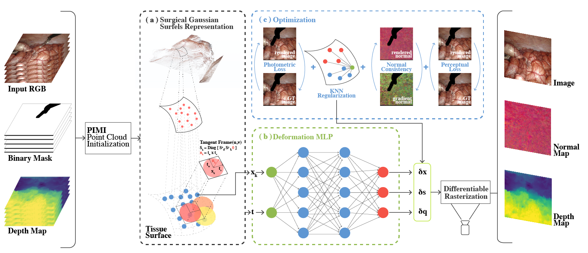

# Surgical Gaussian Surfels: Highly Accurate Surgical Surface Reconstruction Using Gaussian Surfels

[//]: # (### [Project Page]&#40;https://ericzzj1989.github.io/sgs&#41;)
_____________________________________________________


## 🏔️ Environment
Please follow the steps below to install dependencies to properly run this repo.

Note: For a smooth install, make sure cudatoolkit 11.8 is native to your device. Check with `nvcc --version`

```bash
git clone --recurse-submodules https://github.com/aloma85/SurgicalGaussianSurfels.git
cd SurgicalGaussianSurfels

# install dependencies then activate.
conda env create -f environment.yml
conda activate SurgicalGaussianSurfels

pip install "git+https://github.com/facebookresearch/pytorch3d.git"
pip install ninja git+https://github.com/NVlabs/tiny-cuda-nn/#subdirectory=bindings/torch

# List conda-installed packages (Optional)
conda list
# Or list pip-installed packages (Optional)
pip list
```
Note: If having issues with .yml file, look in `dependencies.txt` to install packages manually

## ⚡ CUDA Fully Fused MLP (Optional Performance Enhancement)

For significantly improved performance, you can optionally build and use the CUDA fully fused MLP implementation for the deformation network. This provides **2-5x speedup** for deformation network forward passes.

### Prerequisites for CUDA MLP:
- CUDA 11.8+
- CMake 3.18+
- pybind11 (already included in environment)

### Installation:

The CUDA MLP uses the existing tiny-cuda-nn torch bindings, so no additional building is required. The module is ready to use immediately.

### Using CUDA MLP in Training:

```bash
# Standard PyTorch implementation (default)
python train.py -s data/EndoNeRF/pulling/pulling_soft_tissues -m pull_output/pulling --config arguments/endonerf/pulling.py

# CUDA fully fused implementation (recommended for performance)
python train.py -s data/EndoNeRF/pulling/pulling_soft_tissues -m pull_output/pulling --config arguments/endonerf/pulling.py --fullyfusedMLP
```

### Testing the Integration:

```bash
# Run comprehensive tests
python test_cuda_mlp.py
```

### Performance Comparison:

| Implementation | Expected Speedup | Memory Usage | Compatibility |
|---------------|------------------|--------------|---------------|
| PyTorch (default) | 1x | Standard | Full |
| CUDA Fully Fused | 2-5x | Optimized | Full |

**Note**: If the CUDA implementation is unavailable or fails to load, the training will automatically fall back to the PyTorch implementation with a warning message.


## 🎯 DINO Features Preprocessing (Optional Enhanced Perceptual Loss)

For improved perceptual loss computation and better training supervision, you can optionally use DINO (Distillation of No Labels) features instead of VGG features. DINO features are more semantically meaningful and provide better supervision for neural rendering tasks.

### Prerequisites for DINO Features:
- `timm` library (for DINO model)
- Sufficient disk space for feature storage
- GPU recommended for faster feature extraction

### Installing DINO Dependencies:

```bash
# Install timm for DINO model
pip install timm

# Verify installation
python -c "import timm; print('DINO dependencies installed successfully')"
```

### Extracting DINO Features:

Before training, extract DINO features for all your training images:

```bash
# Extract DINO features for your dataset
python extract_dino_features.py \
    --image_dir /path/to/your/training/images \
    --output_dir /path/to/save/dino_features

# Example for EndoNeRF dataset:
python extract_dino_features.py \
    --image_dir data/EndoNeRF/cutting/cutting_tissues_twice/images \
    --output_dir data/EndoNeRF/cutting/cutting_tissues_twice/dino_features
```

This will:
- Load all images from the specified directory
- Extract DINO features using a pre-trained Vision Transformer
- Save features as `.npy` files with the same base names as the images

### Training with DINO Features:

When running training, specify the DINO feature directory:

```bash
# Standard training (uses VGG features)
python train.py -s data/EndoNeRF/pulling/pulling_soft_tissues -m pull_output/pulling --config arguments/endonerf/pulling.py

# Training with DINO features (enhanced perceptual loss)
python train.py -s data/EndoNeRF/pulling/pulling_soft_tissues -m pull_output/pulling --config arguments/endonerf/pulling.py \
    --dino_feature_dir data/EndoNeRF/pulling/pulling_soft_tissues/dino_features \
    --lambda_perceptual 1.0
```

### Performance Benefits:

| Feature Type | Semantic Meaning | Training Speed | Memory Usage |
|-------------|------------------|----------------|--------------|
| VGG (default) | Low-level features | Standard | Standard |
| DINO | High-level semantic features | Faster (pre-extracted) | Optimized |

**Note**: If DINO features are not found, the system will automatically fall back to on-the-fly VGG feature extraction.

## 💿 Dataset
**EndoNeRF Dataset:**  
Visit [EndoNeRF](https://github.com/med-air/EndoNeRF) to download their dataset. We make use of frames from `pulling_soft_tissues` and `cutting_tissues_twice` in our experiments.

**StereoMIS Dataset:**  
Visit [StereoMIS](https://zenodo.org/records/7727692) to download their dataset. We make use of frames from `p2-7` and `p2-8`.

We advise user to structure dataset as such:
```
├── data
│   | EndoNeRF 
│     ├── pulling
        ├── pulling_soft_tissues
│     ├── cutting
        ├── cutting_tissues_twice
│   | StereoMIS
│     ├── intestine
│     ├── liver

```


## ⏳ Training
To train a model on the EndoNerf `pulling` dataset, you can use three different MLP implementations for the deformation network:

### Standard PyTorch MLP (Default)
```bash
python train.py -s data/EndoNeRF/pulling/pulling_soft_tissues -m pull_output/pulling --config arguments/endonerf/pulling.py
```

### CutlassMLP (Faster, 256 neurons)
```bash
python train.py -s data/EndoNeRF/pulling/pulling_soft_tissues -m pull_output/pulling --config arguments/endonerf/pulling.py --cutlassMLP
```

### FullyFusedMLP (Fastest, 128 neurons)
```bash
python train.py -s data/EndoNeRF/pulling/pulling_soft_tissues -m pull_output/pulling --config arguments/endonerf/pulling.py --fullyfusedMLP
```

**Performance Comparison:**
- **Standard MLP**: Full flexibility, slower training
- **CutlassMLP**: 2-3x faster training, 256 neurons, residual connections
- **FullyFusedMLP**: 3-5x faster training, 128 neurons, optimized CUDA kernels

**Note**: 
- Only one MLP flag can be used at a time
- Use the same MLP type for both training and rendering
- FullyFusedMLP automatically uses increased TV loss for better inpainting

## ✏️ Rendering
Run this script to render the images. The rendering script supports three different MLP implementations for the deformation network:

### Standard PyTorch MLP (Default)
```bash
python render.py -m pull_output/pulling
```

### CutlassMLP (Faster, 256 neurons)
```bash
python render.py -m pull_output/pulling --cutlassMLP
```

### FullyFusedMLP (Fastest, 128 neurons)
```bash
python render.py -m pull_output/pulling --fullyfusedMLP
```

**Note**: 
- Use the same MLP type for rendering that was used during training
- Only one MLP flag can be used at a time
- If no MLP flag is specified, the standard PyTorch implementation is used

## 🔎 Evaluation
Run this script to evaluate the model.  

```
python metrics.py -m pull_output/pulling
```

---
## 👍🏿 Acknowledgement


Source code is borrowed from  [2DG](https://github.com/hbb1/2d-gaussian-splatting),  [Surfels](https://github.com/turandai/gaussian_surfels),  [3DGS](https://github.com/graphdeco-inria/gaussian-splatting), [4DGS](https://github.com/hustvl/4DGaussians), and [Deformable-3D-Gaussian](https://github.com/ingra14m/Deformable-3D-Gaussians/tree/main). We appreciate your fine work.


## 📜 Citation
If you find this work helpful, welcome to cite this paper. 
```
@InProceedings{,
  author    = {},
  title     = {Surgical Gaussian Surfels: Highly Accurate Surgical Surface Reconstruction Using Gaussian Surfels},
  booktitle = {},
  year      = {2025},
}
```

